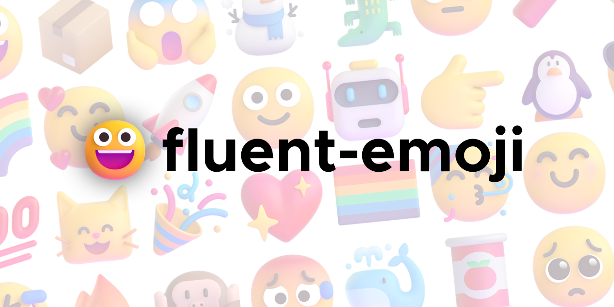

A collection of (nearly) all fluent emoji, sourced from [microsofts open source repository](https://github.com/microsoft/fluentui-emoji/) as well as [emojipedia](https://emojipedia.org/microsoft-teams/).

## Directories
- `/animated/` apng images, animated [`256x256`]
- `/animated-static/` apng images, animated where possible, the rest use static pngs [`256x256`]
- `/static/` png images [`256x256`]
- `/vector/` svg images [`vector, 32x32 by default`]

## Missing Emoji
- **Flags** Not provided by Microsoft due to potential political difficulties
- **Regional Indicators** Likely due to a lack of flags, windows just renders them as smaller capital letters